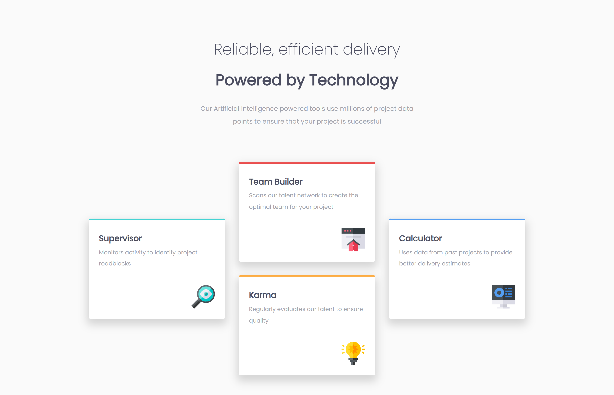

# Frontend Mentor - Four card feature section solution

This is a solution to the [Four card feature section challenge on Frontend Mentor](https://www.frontendmentor.io/challenges/four-card-feature-section-weK1eFYK). Frontend Mentor challenges help you improve your coding skills by building realistic projects. 

## Table of contents

- [Overview](#overview)
  - [The challenge](#the-challenge)
  - [Screenshot](#screenshot)
  - [Links](#links)
- [My process](#my-process)
  - [Built with](#built-with)
  - [What I learned](#what-i-learned)
  - [Continued development](#continued-development)
  - [Useful resources](#useful-resources)
- [Author](#author)

## Overview

### The challenge

Users should be able to:

- View the optimal layout for the site depending on their device's screen size

### Screenshot

### Links

- [Solution URL]()
- [Live Site URL](https://yemima20.github.io/four-card-feature-section/)

## My process

### Built with

- Semantic HTML5 markup
- CSS custom properties & function
- Flexbox & Grid
- SASS (SCSS)
- Mobile-first workflow

### What I learned

Major learnings while working through this project using Grid and SASS file structure, build-in modules, and at-rules in flow-control.

### Continued development

The areas I want to focus on in future projects are using grids on more complex layouts and implement more SASS modules and rules.

### Useful resources

- [Grid] - [Tool](https://layout.bradwoods.io/), [article](https://web.dev/learn/css/grid/)
- [SASS] - [File structure](https://dev.to/technoph1le/a-modern-sass-folder-structure-330f), [modules & rules](https://sass-lang.com/documentation/)

## Author
- Frontend Mentor - [@Yemima20](https://www.frontendmentor.io/profile/Yemima20)